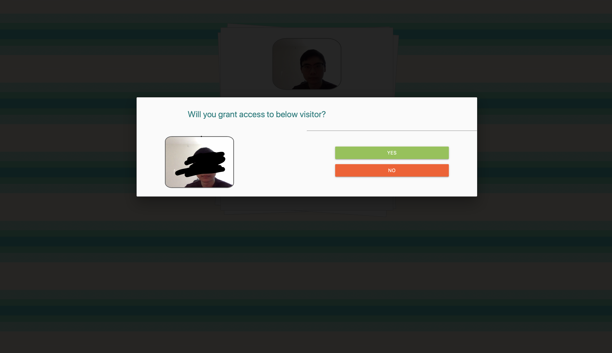
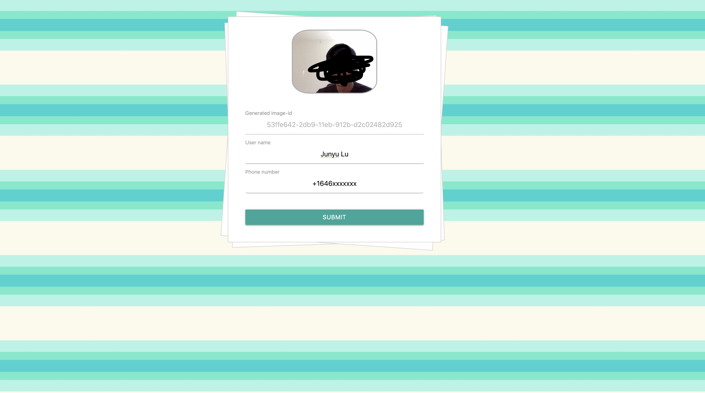
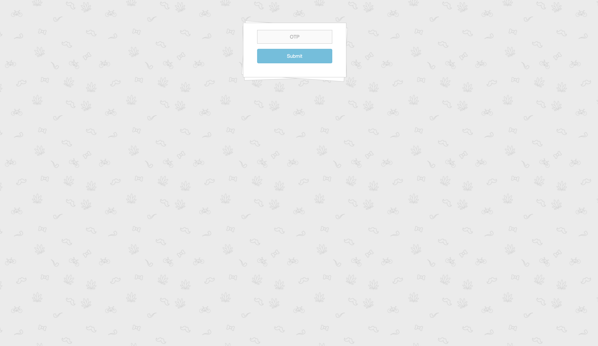

# Smart-Door-2020
## sd_lambda_1.py 
Process KDS and sent message to onwer or visitor

## sd-wf1.py
approving a requset from owner

## sd-wf2.py
enter otp

## Unknown visitor request

## Approve visitor request

## Enter passcode

## Success

## passcode is not correct

